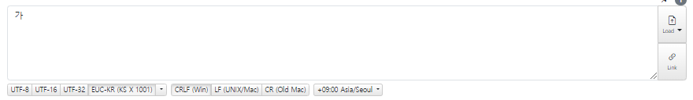
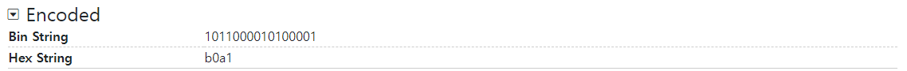

# Chapter02. 데이터

# 02-2 0과 1로 문자를 표현하는 방법

컴퓨터에 입력하는 문자에는 숫자 이외에도 한글, 영어, 특수 문자도 있다.

0과 1밖에 모르는 컴퓨터가 문자를 이해하고 표현하는 여러가지 방법들이 존재한다.

## 문자 집합과 인코딩

1. 문자 집합(character set)
    1. 컴퓨터가 이해할 수 있는 문자의 모음
    2. 컴퓨터는 문자 집합에 속해 있는 문자를 이해할 수 있고, 문자 집합에 속해 있지 않은 문자는 이해할 수 없다.
2. 문자 인코딩(character encoding)
    1. 단어 뜻 그대로 어떤 값을 코드화하는 과정(인코딩 용어는 다양한 곳에서 사용한다.)
    2. 컴퓨터의 문자 인코딩은 **문자 집합에 속한 문자를 0과 1로 이루어진 문자 코드로 변환하는 과정**
3. 문자 디코딩(character decoding)
    1. 코드를 해석하는 과정
    2. 0과 1로 표현된 문자 코드(인코딩된 코드)를 문자로 변환하는 과정

## 아스키 코드

**아스키**(American Standard Code for Information Interchange, ASCII)는 초창기 문자 집합 중 하나로,  
영어 알파벳, 아라비아 숫자, 일부 특수문자 및 제어 문자를 포함하고 매우 대중적으로 쓰인다.

보통 하나의 아스키 문자는 7비트로 표현되는데, 실제로는 8비트가 쓰이고 1비트는 오류 검출을 위한 패리티 비트(parity bit)로 사용한다.

아스키 문자는 7비트로 표현하기 때문에 27개, 총 128개의 문자를 표현한다.

| 십진수 | 십육진수 | 문자 |
|-----|------|----|
| 65  | 41   | A  |
| 66  | 42   | B  |
| 67  | 43   | C  |

예를 들어,  
'A'는 십진수 65(1000001(2))로 인코딩되고, 'B'는 십진수 66(1000010(2))으로 인코딩된다.  
65와 66처럼 글자에 부여된 고유한 값을 코드 포인트라고 한다.

아스키 코드를 보면 영어와 숫자 이외에도 Backspace, Esc와 같은 제어 문자도 포함되어 있다.
- [아스키 코드 제어 문자표](https://ko.wikipedia.org/wiki/ASCII#%EC%A0%9C%EC%96%B4_%EB%AC%B8%EC%9E%90%ED%91%9C)
- [아스키 코드 출력 가능 문자표](https://ko.wikipedia.org/wiki/ASCII#%EC%B6%9C%EB%A0%A5_%EA%B0%80%EB%8A%A5_%EC%95%84%EC%8A%A4%ED%82%A4_%EB%AC%B8%EC%9E%90%ED%91%9C)

아스키 코드는 문자에 부여된 값들을 그대로 간단히 인코딩해서 쓸 수 있는 장점이 있지만 더 다양한 언어, 문자들을 표현할 수 없다는 단점이 있다.  
아스키 코드에 1비트를 추가한 8비트의 확장 아스키(extended ASCII)가 등장했지만 여전히 문자의 수는 부족했다.

때문에 언어별로 0과 1로 표현할 수 있는 인코딩 방식이 등장하게 된다.

## 한글 인코딩

영어는 알파벳을 쭉 나열하면 단어가 완성되지만,  
한글의 경우 각 음절 하나하나가 초성, 중성, 종성의 조합으로 이루어져 있다.

이러한 조합으로 한글 인코딩에는 **완성형**과 **조합형** 두 가지 방식이 존재한다.

### 완성형 인코딩

초성, 중성, 종성의 조합으로 이루어진 완성된 하나의 글자에 고유한 코드를 부여하는 인코딩 방식이다.

예를 들어 '가'는 1001, '나'는 1002

### 조합형 인코딩

초성을 위한 비트열, 중성을 위한 비트열, 종성을 위한 비트열이 각각 존재해서 그것들의 조합으로 하나의 글자 코드를 완성하는 인코딩 방식이다.

예를 들어 'ㄱ'은 10, 'ㅏ'는 01을 할당해서 '가'는 1001로 글자를 만드는 방식

### EUC-KR

한글을 표현하기 위해 **EUC-KR**이라는 인코딩 방식은 'KS X 1001 KS X 1003'라는 문자 집합 기반의 완성형 인코딩 방식이다.  
글자 하나 하나에 2바이트 크기의 코드를 부여한다. 2바이트는 16비트, 즉 4자리 십육진수로 표현할 수 있다.

- [dencode](https://dencode.com/)

위 사이트에서 인코딩 방식 목록 중 EUC-KR(KS X 1001)로 변경하고 텍스트 필드에 '가'라는 글자를 입력해보면,  
**Encoded**부분에서 '가' 글자의 이진수, 십육진수 표현값을 확인할 수 있다.

EUC-KR 인코딩 방식으로 2,350개 정도의 한글 단어를 표현할 수 있지만 모든 한글 조합을 표현할 수 있을 정도로 많은 양은 아니기 때문에,  
EUC-KR 인코딩을 사용하는 웹사이트는 한글이 깨진다거나 사용할 수 없는 단어로 인해 피해를 보는 경우도 발생한다.

## 유니코드와 UTF-8

### 유니코드

EUC-KR처럼 언어별 인코딩을 국가마다 적용해야 한다면 다국어를 지원하는 프로그램을 개발할 땐 언어별 인코딩 방식을 모두 이해해야 하는 불편함이 생길 수 있다.  
이러한 이유로 모든 언어, 특수문자까지 통일된 하나의 커다란 문자 집합과 인코딩 방식이 필요해졌다.

그래서 등장한 것이 **유니코드**(unicode) 문자 집합이다.

유니코드는 EUC-KR보다 훨씬 다양한 한글과 대부분 나라의 문자, 특수문자, 이모티콘까지 코드로 표현할 수 있는 통일된 문자 집합이고,  
현대 문자를 표현할 때 가장 많이 사용되고 중요한 역할을 한다.

- [unicode blocks](https://symbl.cc/en/unicode/blocks/)

위 사이트에서 볼 수 있듯이 다양한 언어와 문자들을 십육진수로 표현하고 있다.

EUC-KR에서 '가'는 b0a1이었는데 유니코드에서는 AC00로 표현하고 있다.

### UTF-8

UTF(Unicode Transformation Format)는 뜻 그대로 유니코드 인코딩 방법을 뜻한다.

UTF-8은 1바이트부터 4바이트까지의 인코딩 결과를 만들어낸다.  
인코딩 결과가 몇 바이트가 될지는 유니코드 문자에 부여된 값에 따라 다르다.

