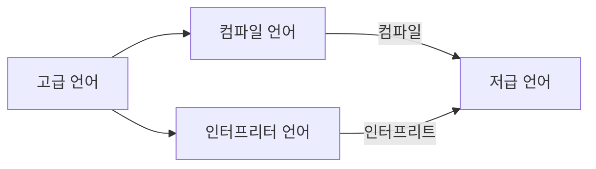

# Chapter03. 명령어

# 03-1. 소스 코드와 명령어

## 고급 언어와 저급 언어

개발자는 C, C++, Java, Python과 같은 프로그래밍 언어를 사용해서 프로그램을 만든다.  
컴퓨터는 그렇게 만들어진 프로그램을 실행해주니까 컴퓨터가 프로그래밍 언어 명령어를 그대로 해석 가능한 것 같지만 그렇지 않다.

프로그램을 만들 때 사용하는 프로그래밍 언어는 컴퓨터가 이해하는 언어가 아닌 `사람이 이해하고 작성하기 쉽게 만들어진 언어로 고급 언어`라고 한다.

고급 언어로 작성된 명령어들을 실행시키려면 `컴퓨터가 이해할 수 있는 저급 언어`로 변환되어야 한다.

저급 언어에는 **기계어**, **어셈블리어** 두 가지가 있다.

### 기계어와 어셈블리어

**기계어**(machine code)란 0과 1의 명령어 비트로 이루어진 언어다.  
컴퓨터가 이해하는 이진수 숫자들로 구성되어 있는데 가독성을 위해 십육진수로 표현하기도 한다.

수많은 0, 1로 이루어진 기계어는 사람이 읽으면 그 의미를 이해하기 어렵기 때문에 기계어를 읽기 편한 형태로 번역한 언어가 **어셈블리어**(assembly language)이다.

어셈블리어는 실제 소스 코드에 직접 입력해서 사용하는 경우도 있다.

## 컴파일 언어와 인터프리터 언어

개발자들이 작성한 고급 언어 소스 코드는 저급 언어로 변환되어 실행되는데,  
여기에는 컴파일 방식과 인터프리트 방식이 있다.

컴파일 방식으로 작동하는 프로그래밍 언어를 컴파일 언어, 인터프리트 방식으로 작동하는 프로그래밍 언어를 인터프리터 언어라고 한다.

### 컴파일 언어

**컴파일 언어**로 작성된 소스 코드는 컴파일러를 통해 컴파일이 된다.

**컴파일은**(compile)은 고급 언어로 작성된 소스 코드 전체를 저급 언어로 변환하는 과정을 뜻하고,  
이 컴파일을 수행하는 도구를 **컴파일러**(compiler)라고 한다.

컴파일 결과로 저급 언어인 **목적 코드**(object code)가 생성된다.

### 인터프리터 언어

소스 코드 전체를 저급 언어로 변환하는 컴파일 언어와는 달리,  
인터프리터 언어는 **인터프리터**(interpreter)에 의해 소스 코드가 한 줄씩 실행되는 고급 언어이다.

컴퓨터와 대화하듯 소스 코드를 한 줄씩 실행하기 때문에 소스 코드 전체를 저급 언어로 변환하는 시간을 기다릴 필요가 없다.