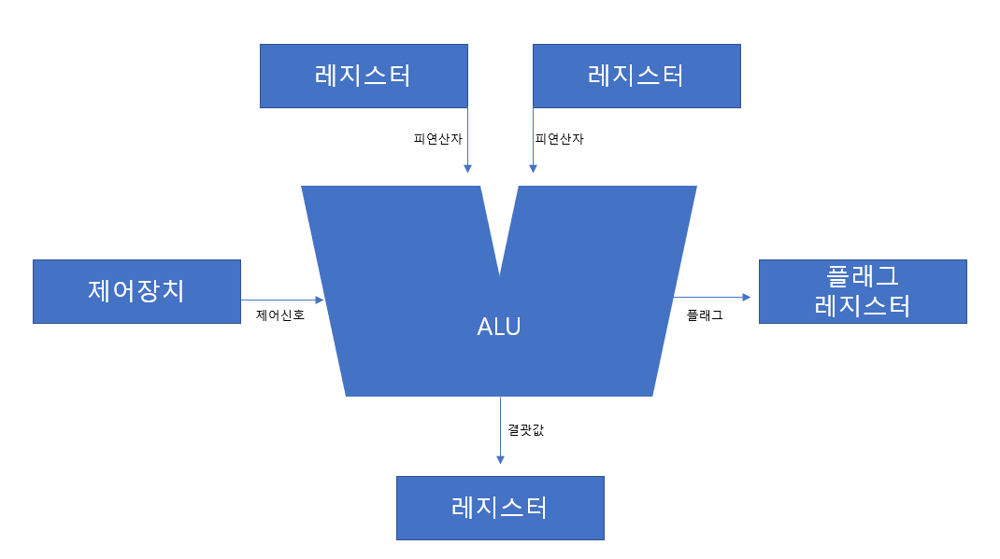
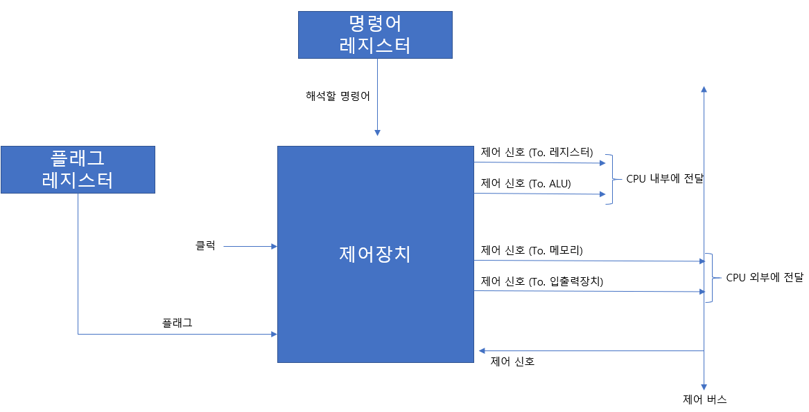

# Chapter04. CPU의 작동 원리

# 04-1. ALU와 제어장치

## ALU

1+2 계산을 할 때 1과 2는 피연산자가 되고 더하기라는 연산을 수행해야 한다.  
ALU가 계산을 하기 위해서도 피연산자와 수행할 연산이 필요하다.

따라서 ALU는 레지스터를 통해 **피연산자**를 받아들이고, 제어장치로부터 수행할 연산을 알려주는 **제어 신호**를 받아들인다.

ALU는 받아들인 피연산자와 제어 신호로 계산을 하고 숫자, 문자, 주소 등등의 결괏값을 레지스터에 담는다.

결괏값은 메모리에 바로 저장하지 않고 일시적으로 레지스터에 저장한다.  
ALU는 CPU의 한 장치이기 때문에 메모리에 도달하는 시간보다 레지스터에 도달하는 시간이 훨씬 빠르기 때문이다.

ALU가 연산 결괏값 이외에도 플래그를 내보내는데,  
**플래그**는 연산 결과에 대한 부가 정보를 나타낸다.

| **플래그 종류** | **의미**                               | **사용 예시**                                                       |
|------------|--------------------------------------|-----------------------------------------------------------------|
| 부호 플래그     | 연산한 결과의 부호를 나타낸다.                    | 부호 플래그가 1일 경우 계산 결과는 음수, 0일 경우 계산 결과는 양수를 의미한다.                 |
| 제로 플래그     | 연산 결과가 0인지 여부를 나타낸다.                 | 제로 플래그가 1일 경우 연산 결과는 0, 0일 경우 연산 결과는 0이 아님을 의미한다.               |
| 캐리 플래그     | 연산 결과 올림수나 빌림수가 발생했는지를 나타낸다.         | 캐리 플래그가 1일 경우 올림수나 빌림수가 발생했음을 의미하고, 0일 경우 발생하지 않았음을 의미한다.       |
| 오버플로우 플래그  | 오버플로우가 발생했는지를 나타낸다.                  | 오버플로우 플래그가 1일 경우 오버플로우가 발생했음을 의미하고, 0일 경우 발생하지 않음을 의미한다.        |
| 인터럽트 플래그   | 인터럽트가 가능한지를 나타낸다.                    | 인터럽트 플래그가 1일 경우 인터럽트가 가능함을 의미하고, 0일 경우 인터럽트가 불가능함을 의미한다.        |
| 슈퍼바이저 플래그  | 커널 모드로 실행 중인지, 사용자 모드로 실행 중인지를 나타낸다. | 슈퍼바이저 플래그가 1일 경우 커널 모드로 실행 중임을 의미하고, 0일 경우 사용자 모드로 실행 중임을 의미한다. |

## 제어장치

제어장치는 제어 신호를 내보내고, 명령어를 해석하는 부품이고,  
제어 신호는 컴퓨터 부품들을 관리하고 작동시키기 위한 일종의 전기 신호이다.

### 제어장치가 받아들이는 정보

- **클럭**(clock)
    - 클럭은 컴퓨터의 모든 부품을 일사불란하게 움직일 수 있게 하는 시간 단위이다.
    - CPU의 작동을 동기화하고 주기적인 전기적 신호로 CPU의 모든 구성 요소가 이 신호에 맞춰 동작하며, 주파수에 따라 CPU의 작동 속도가 결정된다.
- **명령어**
    - 명령어 레지스러로부터 해석할 명령어를 받아들이고, 해석한 뒤 제어 신호를 발생시켜 컴퓨터 부품들에 수행해야 할 내용을 알려준다.
- **플래그**
    - 플래그 레지스터로부터 플래그 값을 받아들이고 이를 참고하여 제어 신호를 발생시킨다.
- **제어 신호**
     - 제어장치가 제어 신호를 보내기도 하지만 CPU 외부의 다른 부품들(예를 들어 입출력장치)에서도 제어 신호를 보내고 이를 받는다.
     - 시스템 버스 중 제어 버스로 전달되어 받는다.

### 제어장치가 내보내는 정보

제어장치는 기본적으로 **제어 신호**를 내보낸다.  
여기에는 크게 CPU 외부에 전달하는 제어 신호와 CPU 내부에 전달하는 제어 신호가 있다.

- CPU 외부
    - 메모리
        - 메모리에 저장된 값을 읽거나 메모리에 새로운 값을 쓸 때 제어 신호를 보낸다.
    - 입출력장치
        - 입출력장치의 값을 읽거나 새로운 값을 쓰고 싶을 때 제어 신호를 보낸다.
- CPU 내부
    - 레지스터
        - 레지스터 간에 데이터를 이동시키거나 레지스터에 저장된 명령어를 해석하기 위한 제어 신호를 내보낸다.
    - ALU
        - 수행할 연산을 지시한다.